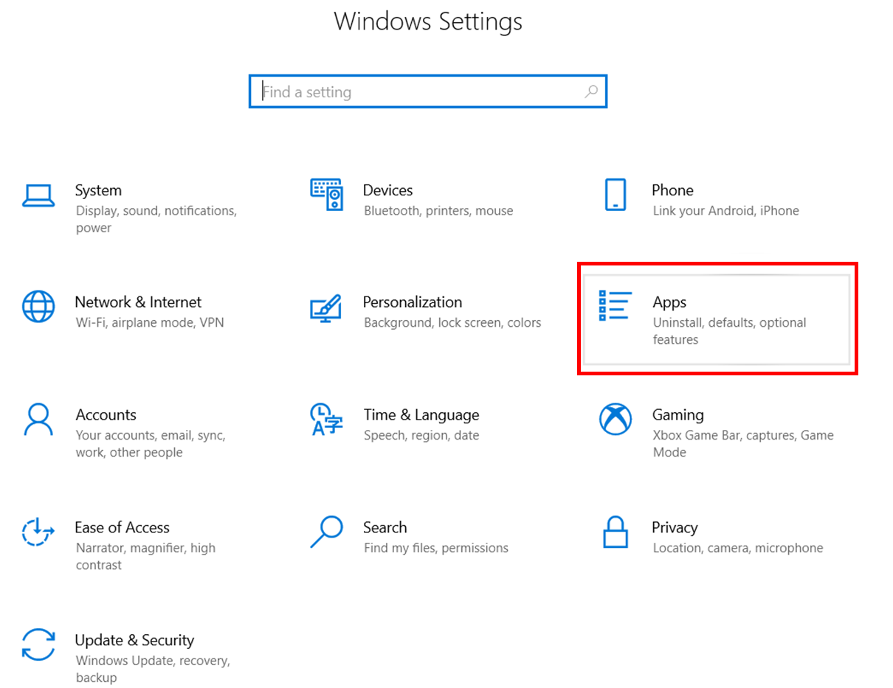
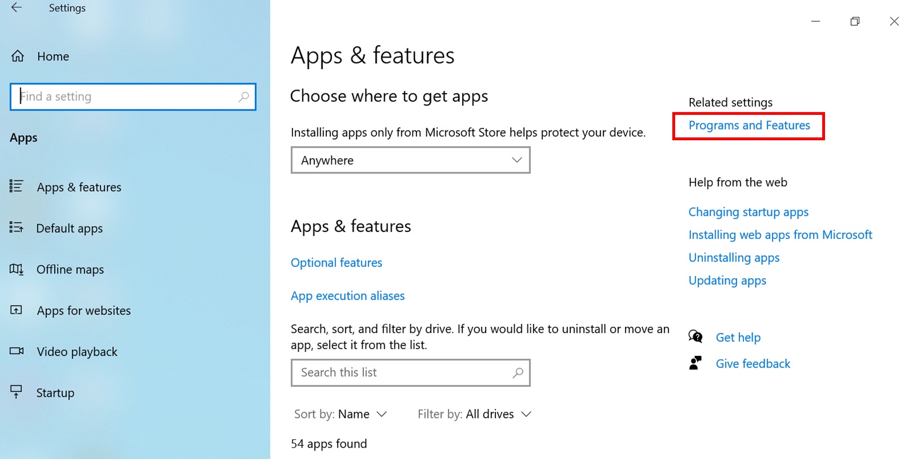
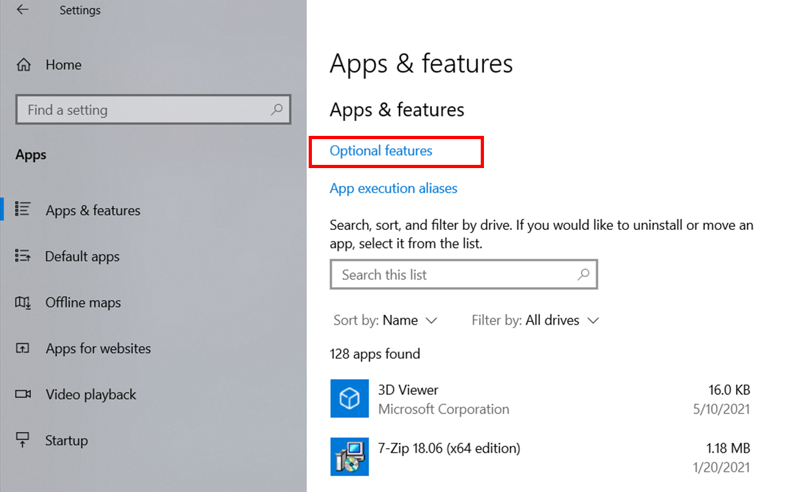
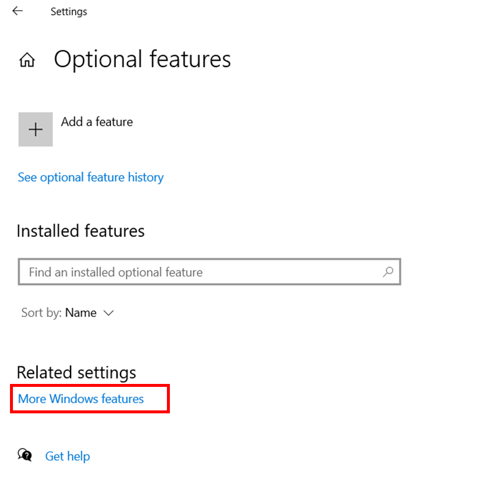
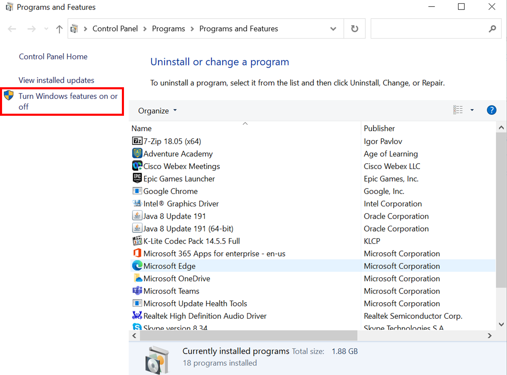
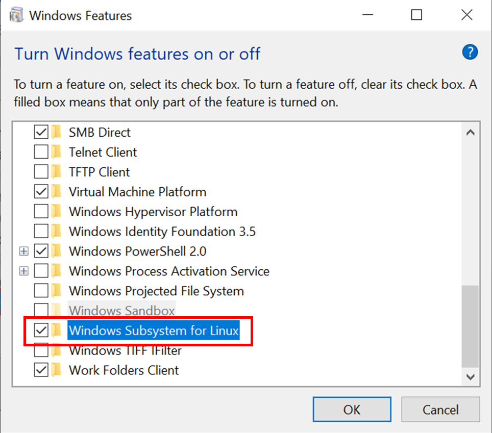
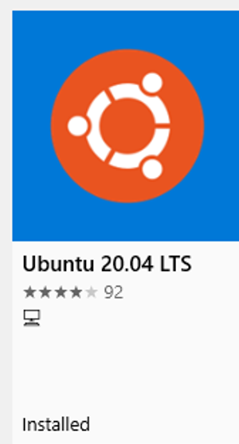
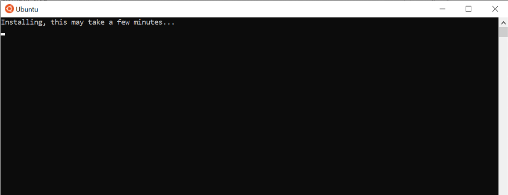
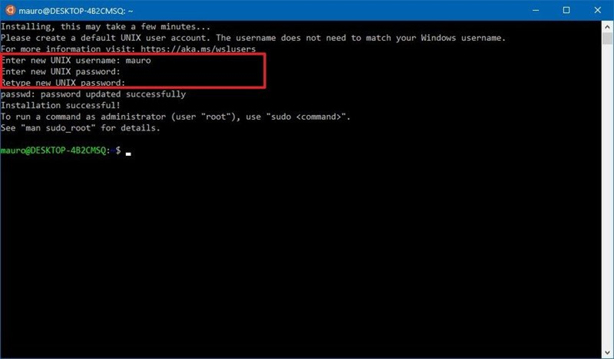
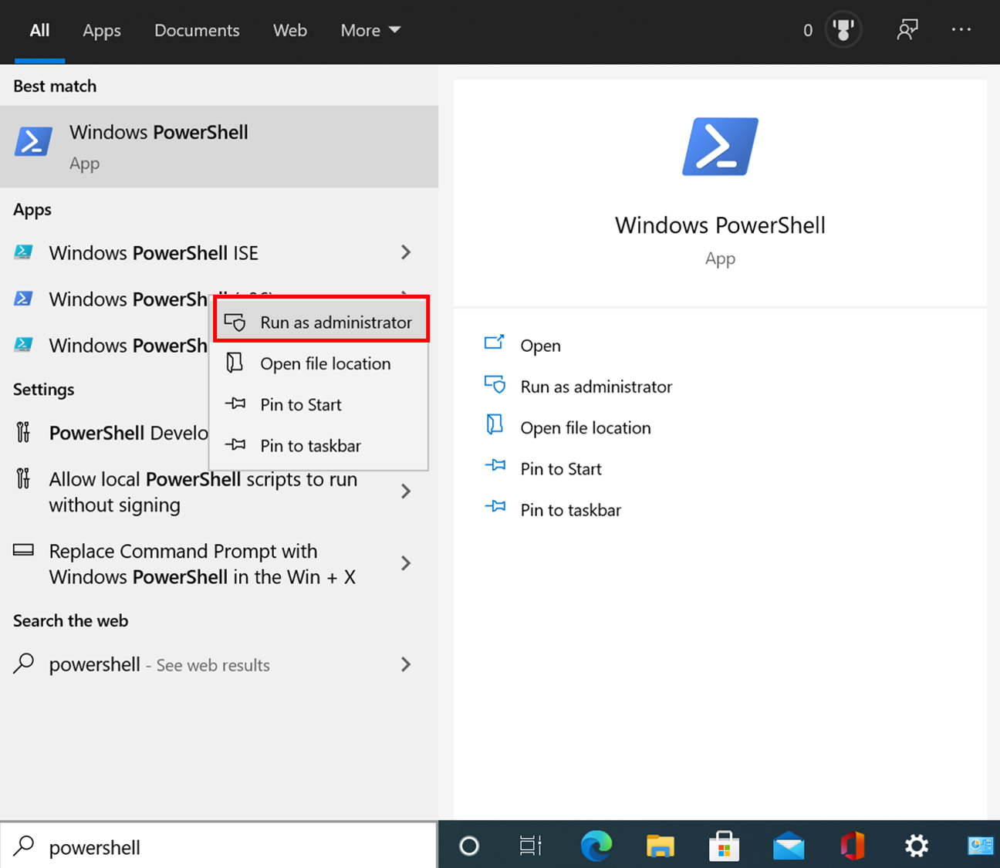

# Setting up a command line

The first step for learning how to work with bash scripting is going to be to set up
a program where you can use a linux/unix command line. Most computers have capabilities
of running a linux command line, but I am only going to give instructions for setting
this up on the most common operating systems. Note, this will require that you have
admin rights on your computer or get someone to enter the admin credentials for you.

## Mac OS

Luckily, Mac OS was built based upon Unix. This means that it already has a built in
command line, called "terminal". This can be found in the "Applications" folder. It
has an icon that looks like this:

By default, it is going to be z-shell (zsh). You don't need to worry about what a
z shell is at this moment, this will be discussed in another folder. If you are not
familiar with zsh, I recommend that you change this to bash. Open terminal, and
paste this into the command line, then hit enter:
`chsh -s /bin/bash`
You will have to enter your account's password because this is changing the default
from zsh to bash, which is an important thing for the computer owner to know. Of
course, you are probably the computer owner so you already know, but you just need
to prove that it is you.

Next, you will need to install Xcode. This is available on the Mac App store and
will require that you use your apple login credentials. It make take a few minutes
to install. Once Xcode installs, restart your computer. Your terminal should be
updated with most of the packages that you will need to run bash from your command
line.

## Windows 10

Windows has historically not worked well with Linux. Most developers require a Linux
environment for at least part of their work, so Windows included a Linux kernel-type
environment with Windows 10. It is known as the "Windows Subsystem for Linux". I was
skeptical at first, but it actually runs very smoothly. Due to Window's compatibility
with most programs that people use on a daily basis (including things like drivers to
printers), I typically recommend that Windows users keep Windows 10 instead of switching
to a Linux operating system. Your programmer friends may prefer Linux, but they also
probably have used it for many years and already know how to deal with things like
installing custom drivers. Most of the information that I have used to write this
can be obtained on [windowscentral.com](https://www.windowscentral.com/install-windows-subsystem-linux-windows-10)

First, open the "Settings" app (can be found in the start menu). Select "Apps".

When it pops up, click the "Programs and Features" option.

Note, if you are not an administrator on your computer, you will have to select the
"Optional features" button to be able to be able to open the list of features that
can open.

Next, select the "More Windows features" option under "Related settings".

This will prompt you to enter credentials of an administrator login for
the computer, if it did not do so at the previous step.

After you are in "Programs and Features," select the option on the left that says
"Turn Windows features on or off".

This will open a list of features that can be changed. Scroll to the very bottom
and check the box next to "Windows Subsystem for Linux". Click "ok". This will prompt
your computer to run several updates and restart. Tell it to restart now. Keep in
mind, running these updates may take a while. If your computer is not particularly new,
this might take half an hour.

After your computer restarts, try installing the Ubuntu app. Use the Microsoft store,
which is an app with an icon that looks like a white shopping bag with the Windows squares.

When the store opens, search for "Ubuntu" in the search bar. It will come up with
several Ubuntu apps, I would recommend using one of the newer versions. At the time
of this writing, the current version is "Ubuntu 20.04 LTS". There are several other
apps that could be used, such as Debian or OpenSuse, but I am only going to write
about the Ubuntu app because I have direct experience using it.

When you select the app, click the "install" button. If you are not already signed
in to the Microsoft store, it will prompt you to login to your Microsoft account.
This is not required, so closing out of the login box without signing in will not
stop the download. Downloading the app may take a while, depending on your internet
connection. Once it is downloaded, click the "launch" button to open the app, or go
to the start menu and look for "Ubuntu". This should open the app, which has a black
background with white writing. The first time it opens, it will say "Installing, this
may take a few minutes ...". On most of my computers this has taken about half an hour.

Once it is done installing, it will prompt you to choose a UNIX user name. I would
recommend choosing something simple and easy to remember, such as first initial and
last name (no spaces). It will then prompt you to choose a password. When you start
typing, nothing will show up on the screen, not even stars to tell you how many
characters you have typed. I have found that this tends to throw people for a loop.
This is normal, it is just a security feature so that people can't see how many
characters long your password is if you are sharing your screen. I would suggest
using a simple password that is easy to remember. In order for someone to get onto
the Ubuntu app on your computer, they already have to log into your computer with
your user name and password, so if this password is not secure, it is not a big deal.
I have known people to use "1234" as a password here, and that is just fine. You will
need to remember this password for any time that you install something that requires
root privileges. After you have entered your password, it will prompt you to enter
the same password again (make sure you didn't have a typo), and then it will be
ready for you to use.

### What if the Ubuntu app says that the Windows Subsystem for Linux isn't installed?

I have tried to install the Ubuntu app on computers following the instructions above
and had the app tell me that the Windows Subystem for Linux isn't installed. If this
is the case, you will need to enable it using Microsoft PowerShell.

Go to your start menu and look for PowerShell. Right click on the top one and select
"Run as administrator". As far as I can tell, PowerShell has no sudo privileges, so
if you opened it as a normal user you are going to have to close it and reopen it as
an admin.

  

Once in PowerShell, run the command `Enable-WindowsOptionalFeature -Online -FeatureName
Microsoft-Windows-Subsystem-Linux` I would recommend copying and pasting this directly.
However, using crtl+v won't paste in PowerShell. Instead, right click using your mouse
and it should paste the copied text. You will have to restart your computer after this
finishes installing, and then download the Ubuntu app just as is explained above.

## Linux

If you have an entire operating system that uses Linux, you probably have enough
experience that my tutorials will not benefit you very much. You can pull up the
command line using the app "QTerminal".
